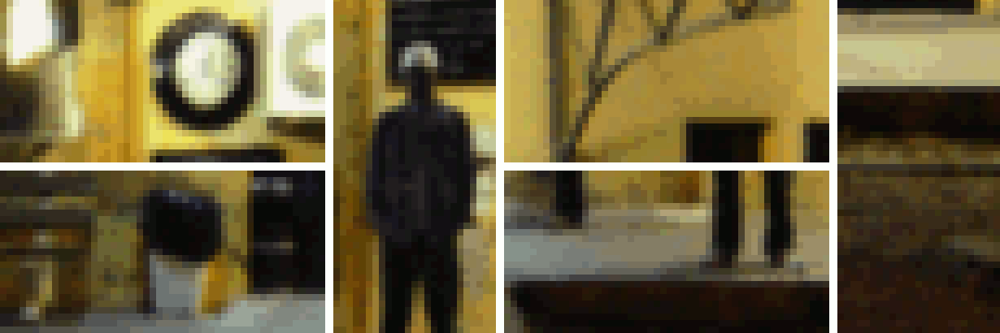
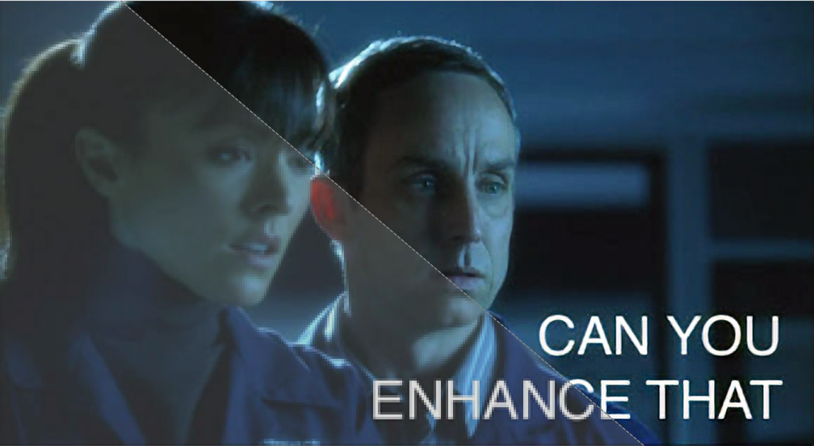
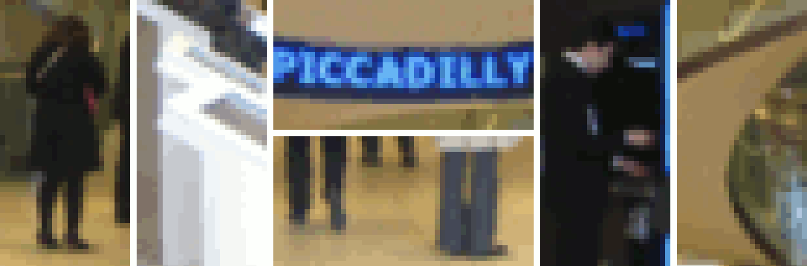
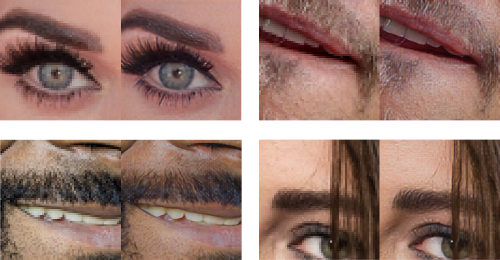

Neural Enhance
==============

**Example #1** — Old Station: `view comparison <http://enhance.nucl.ai/w/0f5177f4-9ce6-11e6-992c-c86000be451f/view>`_ in 24-bit HD, `original photo <https://flic.kr/p/oYhbBv>`_ CC-BY-SA @siv-athens.

----

`As seen on TV! <https://www.youtube.com/watch?v=LhF_56SxrGk>`_ What if you could increase the resolution of your photos using technology from CSI laboratories? Thanks to deep learning and ``#NeuralEnhance``, it's now possible to train a neural network to zoom in to your images at 2x or even 4x.  You'll get even better results by increasing the number of neurons or training with a dataset similar to your low resolution image.

The catch? The neural network is hallucinating details based on its training from example images. It's not reconstructing your photo exactly as it would have been if it was HD. That's only possible in Hollywood — but using deep learning as "Creative AI" works and it is just as cool!  Here's how you can get started...

1. `Examples & Usage <#1-examples--usage>`_
2. `Installation <#2-installation--setup>`_
3. `Background & Research <#3-background--research>`_
4. `Troubleshooting <#4-troubleshooting-problems>`_
5. `Frequent Questions <#5-frequent-questions>`_

|Python Version| |License Type| |Project Stars|

1. Examples & Usage
===================

The main script is called ``enhance.py``, which you can run with Python 3.4+ once it's `setup <#2-installation--setup>`_ as below.  The ``--device`` argument that lets you specify which GPU or CPU to use. For the samples above, here are the performance results:

* **GPU Rendering HQ** — Assuming you have CUDA setup and enough on-board RAM to fit the image and neural network, generating 1080p output should complete in 5 seconds, or 2s per image if multiple at the same time.
* **CPU Rendering HQ** — This will take roughly 20 to 60 seconds for 1080p output, however on most machines you can run 4-8 processes simultaneously given enough system RAM. Runtime depends on the neural network size.

The default is to use ``--device=cpu``, if you have NVIDIA card setup with CUDA already try ``--device=gpu0``. On the CPU, you can also set environment variable to ``OMP_NUM_THREADS=4``, which is most useful when running the script multiple times in parallel.

1.a) Enhancing Images
---------------------

A list of example command lines you can use with the pre-trained models provided in the GitHub releases:

.. code:: bash

    # Run the super-resolution script to repair JPEG artefacts, zoom factor 1:1.
    python3 enhance.py --type=photo --model=repair --zoom=1 broken.jpg

    # Process multiple good quality images with a single run, zoom factor 2:1.
    python3 enhance.py --type=photo --zoom=2 file1.jpg file2.jpg

    # Display output images that were given `_ne?x.png` suffix.
    open *_ne?x.png

Here's a list of currently supported models, image types, and zoom levels in one table.

==================  =====================  ====================  =====================  ====================
     FEATURES        ``--model=default``    ``--model=repair``    ``--model=denoise``    ``--model=deblur``
==================  =====================  ====================  =====================  ====================
 ``--type=photo``            2x                     1x                     …                      …         
==================  =====================  ====================  =====================  ====================

1.b) Training Super-Resolution
------------------------------

Pre-trained models are provided in the GitHub releases.  Training your own is a delicate process that may require you to pick parameters based on your image dataset.

.. code:: bash

    # Remove the model file as don't want to reload the data to fine-tune it.
    rm -f ne?x*.pkl.bz2

    # Pre-train the model using perceptual loss from paper [1] below.
    python3.4 enhance.py --train "data/*.jpg" --model custom --scales=2 --epochs=50 \
        --perceptual-layer=conv2_2 --smoothness-weight=1e7 --adversary-weight=0.0 \
        --generator-blocks=4 --generator-filters=64
    
    # Train the model using an adversarial setup based on [4] below.
    python3.4 enhance.py --train "data/*.jpg" --model custom --scales=2 --epochs=250 \
             --perceptual-layer=conv5_2 --smoothness-weight=2e4 --adversary-weight=1e3 \
             --generator-start=5 --discriminator-start=0 --adversarial-start=5 \
             --discriminator-size=64

    # The newly trained model is output into this file...
    ls ne?x-custom-*.pkl.bz2

**Example #2** — Bank Lobby: `view comparison <http://enhance.nucl.ai/w/38d10880-9ce6-11e6-becb-c86000be451f/view>`_ in 24-bit HD, `original photo <https://flic.kr/p/6a8cwm>`_ CC-BY-SA @benarent.

2. Installation & Setup
=======================

2.a) Using Docker Image [recommended]
-------------------------------------

The easiest way to get up-and-running is to `install Docker <https://www.docker.com/>`_. Then, you should be able to download and run the pre-built image using the ``docker`` command line tool.  Find out more about the ``alexjc/neural-enhance`` image on its `Docker Hub <https://hub.docker.com/r/alexjc/neural-enhance/>`_ page.

Here's the simplest way you can call the script using ``docker``, assuming you're familiar with using ``-v`` argument to mount folders you can use this directly to specify files to enhance:

.. code:: bash

    # Download the Docker image and show the help text to make sure it works.
    docker run --rm -v `pwd`:/ne/input -it alexjc/neural-enhance --help

**Single Image** — In practice, we suggest you setup an alias called ``enhance`` to automatically expose the folder containing your specified image, so the script can read it and store results where you can access them.  This is how you can do it in your terminal console on OSX or Linux:

.. code:: bash

    # Setup the alias. Put this in your .bashrc or .zshrc file so it's available at startup.
    alias enhance='function ne() { docker run --rm -v "$(pwd)/`dirname ${@:$#}`":/ne/input -it alexjc/neural-enhance ${@:1:$#-1} "input/`basename ${@:$#}`"; }; ne'

    # Now run any of the examples above using this alias, without the `.py` extension.
    enhance --zoom=1 --model=repair images/broken.jpg

**Multiple Images** — To enhance multiple images in a row (faster) from a folder or wildcard specification, make sure to quote the argument to the alias command:

.. code:: bash
    
    # Process multiple images, make sure to quote the argument!
    enhance --zoom=2 "images/*.jpg"

If you want to run on your NVIDIA GPU, you can instead change the alias to use the image ``alexjc/neural-enhance:gpu`` which comes with CUDA and CUDNN pre-installed.  Then run it within `nvidia-docker <https://github.com/NVIDIA/nvidia-docker>`_ and it should use your physical hardware!

2.b) Manual Installation [developers]
-------------------------------------

This project requires Python 3.4+ and you'll also need ``numpy`` and ``scipy`` (numerical computing libraries) as well as ``python3-dev`` installed system-wide.  If you want more detailed instructions, follow these:

1. `Linux Installation of Lasagne <https://github.com/Lasagne/Lasagne/wiki/From-Zero-to-Lasagne-on-Ubuntu-14.04>`_ **(intermediate)**
2. `Mac OSX Installation of Lasagne <http://deeplearning.net/software/theano/install.html#mac-os>`_ **(advanced)**
3. `Windows Installation of Lasagne <https://github.com/Lasagne/Lasagne/wiki/From-Zero-to-Lasagne-on-Windows-7-%2864-bit%29>`_ **(expert)**

Afterward fetching the repository, you can run the following commands from your terminal to setup a local environment:

.. code:: bash

    # Create a local environment for Python 3.x to install dependencies here.
    python3 -m venv pyvenv --system-site-packages

    # If you're using bash, make this the active version of Python.
    source pyvenv/bin/activate

    # Setup the required dependencies simply using the PIP module.
    python3 -m pip install --ignore-installed -r requirements.txt

After this, you should have ``pillow``, ``theano`` and ``lasagne`` installed in your virtual environment.  You'll also need to download this `pre-trained neural network <https://github.com/alexjc/neural-doodle/releases/download/v0.0/vgg19_conv.pkl.bz2>`_ (VGG19, 80Mb) and put it in the same folder as the script to run. To de-install everything, you can just delete the ``#/pyvenv/`` folder.

**Example #3** — Specialized super-resolution for faces, trained on HD examples of celebrity faces only.  The quality is significantly higher when narrowing the domain from "photos" in general.

3. Background & Research
========================

This code uses a combination of techniques from the following papers, as well as some minor improvements yet to be documented (watch this repository for updates):

1. `Perceptual Losses for Real-Time Style Transfer and Super-Resolution <http://arxiv.org/abs/1603.08155>`_
2. `Real-Time Super-Resolution Using Efficient Sub-Pixel Convolution <https://arxiv.org/abs/1609.05158>`_
3. `Deeply-Recursive Convolutional Network for Image Super-Resolution <https://arxiv.org/abs/1511.04491>`_
4. `Photo-Realistic Super-Resolution Using a Generative Adversarial Network <https://arxiv.org/abs/1609.04802>`_

Special thanks for their help and support in various ways:

* Eder Santana — Discussions, encouragement, and his ideas on `sub-pixel deconvolution <https://github.com/Tetrachrome/subpixel>`_.
* Andrew Brock — This sub-pixel layer code is based on `his project repository <https://github.com/ajbrock/Neural-Photo-Editor>`_ using Lasagne.
* Casper Kaae Sønderby — For suggesting a more stable alternative to sigmoid + log as GAN loss functions.

4. Troubleshooting Problems
===========================

Can't install or Unable to find pgen, not compiling formal grammar.
-------------------------------------------------------------------

There's a Python extension compiler called Cython, and it's missing or improperly installed. Try getting it directly from the system package manager rather than PIP.

**FIX:** ``sudo apt-get install cython3``

NotImplementedError: AbstractConv2d theano optimization failed.
---------------------------------------------------------------

This happens when you're running without a GPU, and the CPU libraries were not found (e.g. ``libblas``).  The neural network expressions cannot be evaluated by Theano and it's raising an exception.

**FIX:** ``sudo apt-get install libblas-dev libopenblas-dev``

TypeError: max_pool_2d() got an unexpected keyword argument 'mode'
------------------------------------------------------------------

You need to install Lasagne and Theano directly from the versions specified in ``requirements.txt``, rather than from the PIP versions.  These alternatives are older and don't have the required features.

**FIX:** ``python3 -m pip install -r requirements.txt``

ValueError: unknown locale: UTF-8
---------------------------------

It seems your terminal is misconfigured and not compatible with the way Python treats locales. You may need to change this in your ``.bashrc`` or other startup script. Alternatively, this command will fix it once for this shell instance.

**FIX:** ``export LC_ALL=en_US.UTF-8``

.. image:: docs/StreetView_example.gif

**Example #4** — Street View: `view comparison <http://enhance.nucl.ai/w/3b3c8054-9d00-11e6-9558-c86000be451f/view>`_ in 24-bit HD, `original photo <https://flic.kr/p/gnxcXH>`_ CC-BY-SA @cyalex.

----

|Python Version| |License Type| |Project Stars|

.. |Python Version| image:: http://aigamedev.github.io/scikit-neuralnetwork/badge_python.svg
    :target: https://www.python.org/

.. |License Type| image:: https://img.shields.io/badge/license-AGPL-blue.svg
    :target: https://github.com/alexjc/neural-enhance/blob/master/LICENSE

.. |Project Stars| image:: https://img.shields.io/github/stars/alexjc/neural-enhance.svg?style=flat
    :target: https://github.com/alexjc/neural-enhance/stargazers
